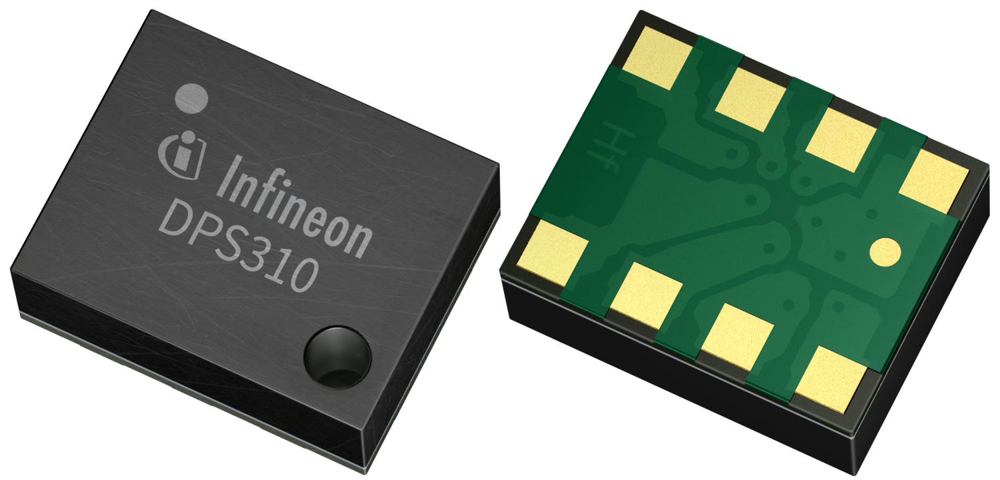
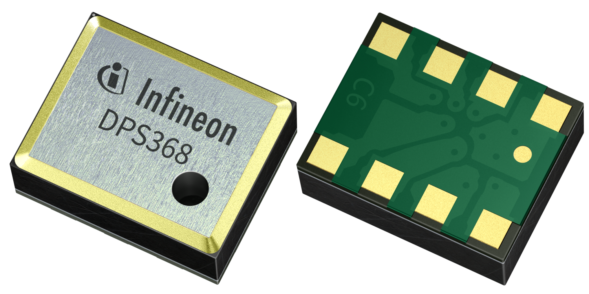
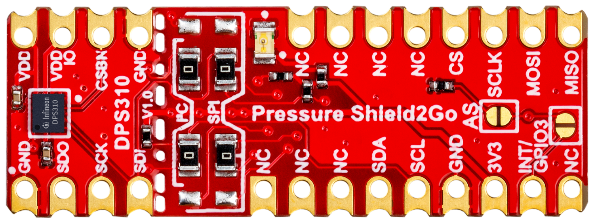
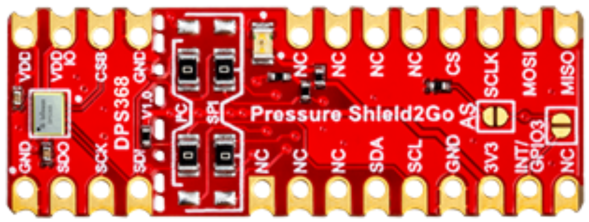
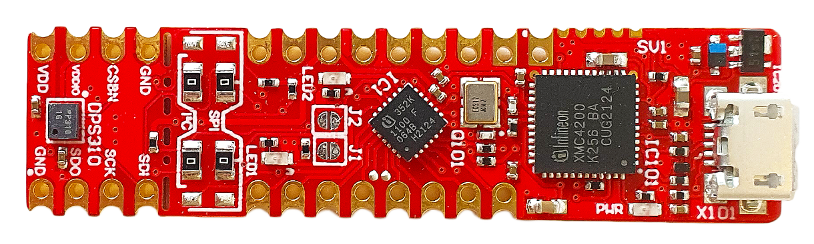
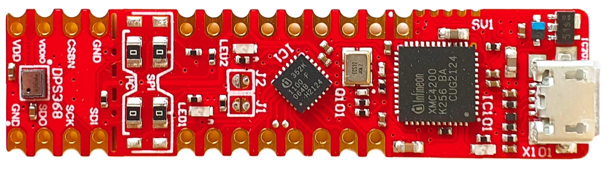

[](https://github.com/Infineon/RaspberryPi_DPS/actions/workflows/check_links.yml)
[](https://pypi.org/project/DigitalPressureSensor/)    

Introduction
============

Python driver for Infineon Digital Barometric Air Pressure Sensor (DPS).


## Supported Products

<table>
    <tr>
        <td rowspan=2>Products</td>
        <td></td>
        <td></td>
    </tr>
    <tr>
        <td style="text-align : center">XENSIV™ DPS310 *(deprecated)*</td>
        <td style="text-align : center"><a href="https://www.infineon.com/part/DPS368">XENSIV™ DPS368</a></td>
    </tr>
    <tr>
        <td rowspan=2>Shield2Go</td>
        <td></td>
        <td></td>
    </tr>
    <tr>
        <td style="text-align : center">XENSIV™ DPS310 Shield2Go *(deprecated)*</td>
        <td style="text-align : center"><a href="https://www.infineon.com/evaluation-board/S2GO-PRESSURE-DPS368">XENSIV™ DPS368 Shield2Go *(deprecated)*</a></td>
    </tr>
    <tr>
       <td rowspan=2>Kit 2Go</td>
        <td></td>
        <td></td>
    </tr>
    <tr>
        <td style="text-align : center">XENSIV™ DPS310 Kit 2Go *(deprecated)*</a></td>
        <td style="text-align : center"><a href="https://www.infineon.com/evaluation-board/KIT-DPS368-2GO">XENSIV™ DPS368 Kit 2Go</a></td>
    </tr>
</table>

Dependencies
============

This driver depends on:

* python >= 3.0
* [SMBus](https://github.com/kplindegaard/smbus2)

Please ensure all dependencies are resolved before proceeding further.

Steps for Installation
----------------------

Supported hardware --> Raspberry pi Zero/3/3B+/4B

* Update apt

```

sudo apt update

```


* Enable I2C (Interfacing options menu and then I2C enable).

```

sudo raspi-config

```


* Install pip3

```

sudo apt install python3-pip

```


* Install smbus

```

pip3 install smbus
sudo apt-get install -y python-smbus i2c-tools

```

Installing from PyPI
--------------------

On supported GNU/Linux systems like Raspberry Pi OS, you can install the driver from [PyPI](https://pypi.org/)

For current user:
```

pip3 install DigitalPressureSensor

```

To install system-wide (this may be required in some cases):
```

sudo pip3 install DigitalPressureSensor

```

Connection diagram:
-------------------
  

| Raspberry Pi | DPS |
| :---: |:---:|
| 3.3V | 3V3 |
| GND | GND |
| BCM 2 (pin3) | SDA |
| BCM 3 (pin 5) | SCL |


**Note-** Connection diagram given with DPS310 and Raspberry Pi is just for reference, all the three versions of DPS will be connected in the same way with any of the Raspberry Pi.

* Clone the Github repository or download the .zip, unzip it, go to examples folder and run the sample code.

